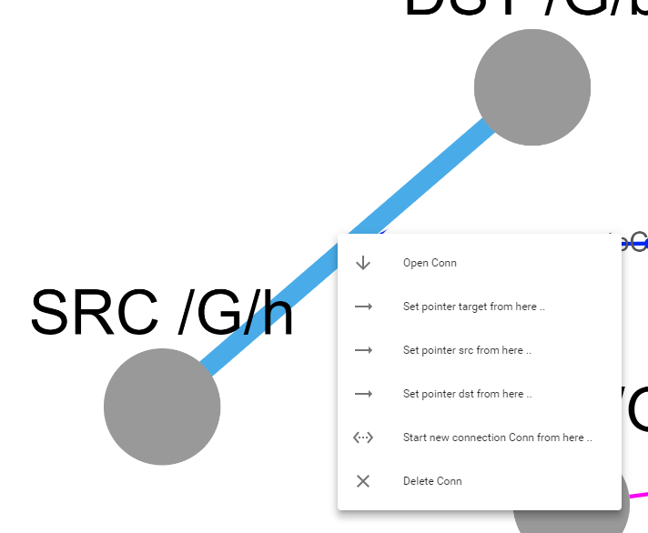

# Hierarchical Model Editor
This is a domain-agnostic model editor for viewing and editing models through 
multiple layers of containment. 

## Try it out from here

- Make sure you have [docker/docker-compose](https://docs.docker.com/compose/install/) installed
- Clone this repository to your local machine
- `cd hierarchical-model-editor`
- `docker-compose up`
- Goto [localhost:8888](http://localhost:8888) using e.g. Chrome

## Add to your WebGME repo
Make sure you've setup your repository using [webgme-cli](https://webgme.readthedocs.io/en/latest/getting_started/creating_a_repository.html): 


- Import using the webgme-cli tool `webgme import viz HierarchicalModelEditor hierarchical-model-editor`
- Register the visualizer at nodes where it should be available.

### Some features
* Images and colors from the models are preserved.

    

* In addition to connections, pointers and set-memberships are rendered as edges.

    

* Relations can be created between the nodes.

    


### Some restrictions
The positions in the cytoscape view are only persisted at one place (under 
the registry `'cytoscapePosition'`). Modifying the layout starting from node 
`/a/b/c` will alter the layout of all children of `/a/b/c` when viewed from 
either `/a` or `/a/b`.

Currently there is no entry point to create new children using the visualizer - only relations and connections can be made.
This feature will be added.

Arrow heads for connections are not extracted and applied as cytoscape requires
such edges to be bezier curves which has really bad performance. (This can be 
made into an option if requested..)

There is currently no lasso or multi-select available. (Children are moved 
together with their parent(s) though.)


## Developers
The visualizer is a bundle (which should not be checked in) of components
from `webgme-react-components`. 

To build use webpack:
```
npm run webpack
```
To build continuously with a watcher:
```
npm run webpack -- -w
```

### Creating a Release
Make sure all node-modules are installed (npm publish will build the
visualizer bundle which will be added to the npmjs registry).

```
npm version 1.0.0 -m "Release %s"
git push origin master
git checkout v1.0.0
git push origin v1.0.0
npm publish ./
```
